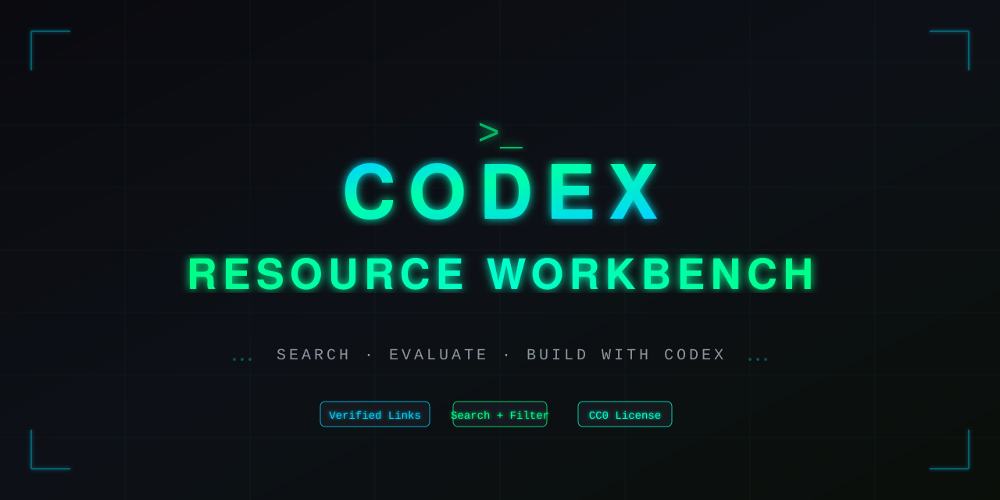

<p align="center">
  
</p>

<h1 align="center">Codex Resource Workbench</h1>

<p align="center">
  <a href="https://github.com/zhaoyeyu/awesome-codex-cli/actions/workflows/ci.yml"></a>
  <a href="https://github.com/zhaoyeyu/awesome-codex-cli/actions/workflows/link-health.yml"></a>
  <a href="https://github.com/zhaoyeyu/awesome-codex-cli/commits/main"></a>
  
</p>

This project is a decision-oriented workbench for the [OpenAI Codex CLI](https://github.com/openai/codex) ecosystem. It turns a long, hard-to-maintain link list into a searchable catalog with categories, tags, risk labels, recorded verification, saved items, and reproducible checks.

It deliberately has a narrower job than a general “awesome Codex” collection: help someone choose a useful tool and understand the review burden before installing it. Official OpenAI documentation remains the source of truth for Codex behavior.

## Open the workbench

The static site lives in [`docs/`](docs/index.html) and is ready for GitHub Pages. To run it locally with no third-party dependencies:

```bash
npm run dev
```

Then open `http://127.0.0.1:4173`.

The interface supports:

- full-text search across names, descriptions, categories, tags, and repository identifiers;
- category, review-level, saved-only, and activity sorting controls;
- shareable URL filters and keyboard search with `/`;
- persistent saved resources and light/dark themes stored only in the browser;
- explicit “review” labels for authentication, proxy, model-routing, and remote-control tools;
- a raw [JSON catalog](docs/catalog.json) for scripts and downstream projects.

## Trust model

“Listed” does not mean “security-reviewed” or “endorsed.” Community projects can execute code, access source files, send data over the network, or handle credentials. Before using one:

1. read its source and installation script;
2. inspect requested filesystem, shell, network, and account permissions;
3. test in a disposable repository or sandbox;
4. pin versions when practical;
5. prefer official Codex capabilities when they already cover the need.

The catalog records reachability and maintenance signals. It does not certify security, privacy, correctness, licensing, or compatibility.

## How the catalog stays maintainable

[`data/resources.json`](data/resources.json) is the single source of truth. The browser-ready JSON and JavaScript payload are generated from it:

```bash
npm run build
npm test
```

Validation rejects malformed records, unknown categories, duplicate IDs, names and URLs, insecure URLs, mismatched GitHub repository metadata, stale generated files, placeholder repository links, likely credentials, private contact details, local paths, and task-specific residue.

Network health checks are separate because remote sites can rate-limit or block automation:

```bash
npm run check:github
npm run check:web
```

GitHub Actions runs deterministic catalog validation on changes, checks links weekly, and can deploy the generated site to GitHub Pages.

## Repository layout

```text
data/resources.json       Canonical structured catalog
docs/                     Dependency-free searchable workbench
scripts/build-site.mjs    Generates browser catalog assets
scripts/validate-catalog.mjs
                          Schema, integrity, and public-boundary checks
scripts/audit-*.mjs       GitHub and external-link health checks
.github/workflows/        CI, scheduled health audit, and Pages deployment
```

## Official starting points

For current product behavior, start with OpenAI’s official sources:

- [Codex documentation](https://developers.openai.com/codex)
- [Codex CLI repository](https://github.com/openai/codex)
- [Configuration reference](https://developers.openai.com/codex/config-reference)
- [AGENTS.md guidance](https://developers.openai.com/codex/guides/agents-md)
- [Skills](https://developers.openai.com/codex/skills), [plugins](https://developers.openai.com/codex/plugins), and [MCP](https://developers.openai.com/codex/mcp)
- [Sandboxing and security](https://developers.openai.com/codex/security)
- [Non-interactive mode](https://developers.openai.com/codex/noninteractive)

## Contributing

Read [CONTRIBUTING.md](CONTRIBUTING.md) before proposing a resource. Submissions need a direct Codex use case, factual and non-promotional copy, a stable HTTPS URL, current maintenance evidence, and an appropriate review label.

This community project is not affiliated with or endorsed by OpenAI. “OpenAI” and “Codex” are trademarks of their respective owner.

The catalog is released under [CC0-1.0](LICENSE).
